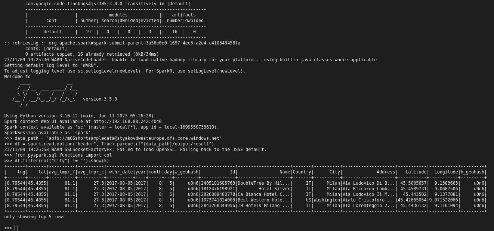

# Spark ETL with data in Azure
## Prerequisites
Installed latest:   
- Azure CLI, 
- terraform, 
- docker, 
- spark installed to /opt/spark/
- setuptools

## Terraform
We can create our resourses manualy in Azure interface or via Azure CLI, but here I will use Terraform.
Before run Terraform we should create and provide to Terraform some Azure storage container so Terraform can use it to save it's state.
Use Azure CLI and login to Azure:
```
az login
```

Create Azure Resource Group and Storage Account, get Storage Account key:
```
az group create --name tf-state-rg \
  --location westeurope

az storage account create --name sa451 \
  --location westeurope \
  --resource-group tf-state-rg

az storage account keys list --account-name sa451
```
Use key from abow, create a storage container so Terraform can store the state management file:
```
az storage container create --account-name sa451 \
  --name tfstate \
  --public-access off \
  --account-key <account-key>
```

When we will apply terraform plan it will ask us to provide state backend data, to avoid it and simplify our life let's add this information directly to main.tf
```
# Setup azurerm as a state backend
terraform {
  backend "azurerm" {
    resource_group_name  = "tf-state-rg"
    storage_account_name = "sa451"
    container_name       = "tfstate"
    key                  = "terraform.tfstate"
  }
}
```
Now we can initialize Terraform working directory, create an execution plan and save the plan to the file, run action plan
```
cd terraform
terraform init
terraform plan -out terraform.plan
terraform apply terraform.plan
```
When terraform ask for prefix use "yakovd", either data in src/config.json should be changed respectively.

## Data
After Terraform created resourses we can put our data to the Azure storage account blob container.
To check access to the data we can use pyspark console this way:
```
pyspark \
  --conf spark.hadoop.fs.azure.account.key.<acc>.dfs.core.windows.net=<key> \
  --packages org.apache.hadoop:hadoop-azure:3.2.0,com.microsoft.azure:azure-storage:8.6.3
```
where:   
**acc** - storage account name,   
**key** - storage account key.  

We can access the data by such path:  
`data_path = f"abfs://{container}>@{account}.dfs.core.windows.net"`

Access check - Pyspark console:


Remark.
To simplify local test-run of spark job I use sample data created by src/jobs/_sampling.py script. Sample data has less size but same format as real data.The sample data uploaded to container "m06shortsampledata".


## Opencage API using
Some UDFS uses https://opencagedata.com/ API, to make it work we should register and obtain Opencage API key then assign environment variable (command for linux shell):
```
export OPENCAGE_API_KEY="< Opencage API key >"   
```

## Unit testing
Do not forget to assign environment variable for OPENCAGE_API_KEY in advance.

Run tests
`pytest src/tests`


## Local run
We will run our job localy on shortened sample data which we loaded to Azure storage container "m06shortsampledata"
For this reason in file src/config.json path to data shoul be changed.

src/config.json string 3,4 in case we use real data:
```
"source_data_path": "abfs://m06sparkbasicsa@styakovdwesteurope.dfs.core.windows.net",
"output_data_path": "abfs://m06sparkbasics@styakovdwesteurope.dfs.core.windows.net/output",
```

src/config.json string 3,4 in case we use sample data:
```
"source_data_path": "abfs://m06shortsampledata@styakovdwesteurope.dfs.core.windows.net",
"output_data_path": "abfs://m06shortsampledata@styakovdwesteurope.dfs.core.windows.net/output",
```

Run our job:
```
spark-submit \
  --conf spark.hadoop.fs.azure.account.key.<acc>.dfs.core.windows.net=<key> \
  --packages org.apache.hadoop:hadoop-azure:3.2.0,com.microsoft.azure:azure-storage:8.6.3 \
  src/main.py --job job
```
where:   
**acc** - storage account name,   
**key** - storage account key. 

Screenshot of Azure container before run:


Azure container after run:


Resulting parquet:


Check results in spark console:




## AKS
To use cubectl with AKS cluster created by terraform:
```
az aks get-credentials --name aks-yakovd-westeurope --resource-group rg-yakovd-westeurope
```
verify the connection: 
```
kubectl get nodes
kubectl cluster-info
```


## Build
python3 setup.py build bdist_egg

## Docker
We will use Azure container registry.  
Create new Azure container registry and login to it:
```
az group create --name rg-CRegistry --location eastus
az acr create --resource-group rg-CRegistry --name dycr1 --sku Basic

az acr login --name dycr1
```

build docker image (option -p is for generating pyspark image):
```
docker-image-tool.sh -r dycr1.azurecr.io -t sparkbasics -p docker/Dockerfile build
```

Push docker image to Azure container
```
docker-image-tool.sh -r dmytrodec6/dockerhub0repo -t v1 push
```

## Run Spark job on AKS
```
spark-submit \
  --master k8s://https://<k8s-apiserver-host>:<k8s-apiserver-port> \
  --deploy-mode cluster \
  --name sparkbasics \
  --conf spark.kubernetes.container.image=<spark-image> \
  --conf spark.hadoop.fs.azure.account.key.<account>.dfs.core.windows.net=<key> \
  --packages org.apache.hadoop:hadoop-azure:3.2.0,com.microsoft.azure:azure-storage:8.6.3 \
  --conf spark.kubernetes.driver.secretKeyRef.ENV_NAME=name:key
  --conf spark.kubernetes.executor.secretKeyRef.ENV_NAME=name:key
  src/main.py --job job
```
